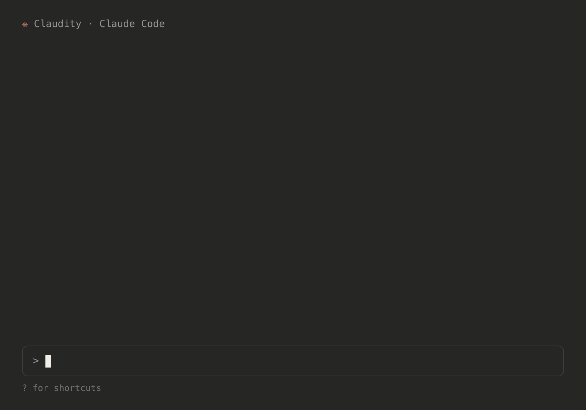

# Claudity

<p align="center">
  
</p>

Claude Code, but it makes sure you're building the right thing: Claudity asks
the questions an architect would ask, and records the answers and decisions as
markdown in your repo.

The animation above is a simulation. For a real session (abridged only for
length) see [EXAMPLE.md](EXAMPLE.md): three turns in, the project has a
different shape, a privacy requirement nobody had thought about, and all of it
written to versionable markdown in the repo.

## Install

```
/plugin marketplace add danielrmay/claudity
/plugin install claudity@claudity
```

Requires Claude Code (a recent version with plugin support), `python3` 3.10+
on PATH (the bundled scripts are stdlib-only, nothing to pip install), and
`git`. Tested on macOS and Linux.

<details>
<summary>Windows notes</summary>

The Python layer (including the bundled MCP server) is CI-verified on
`windows-latest`, but Claude Code itself running the plugin natively on
Windows has not been validated. Two known requirements:

- Claude Code's Bash tool needs Git for Windows.
- The plugin invokes `python3`. The python.org installer registers
  `python`/`py` but not `python3` (the Microsoft Store build does), so create
  an alias or shim if `python3` doesn't resolve.

</details>

## Quickstart

1. In your project, run `/claudity:embed`. This scaffolds `.clarity-protocol/`
   with template documents and adds a managed block to your `CLAUDE.md`.
2. Describe what you're building (or run `/claudity:start`). Claudity asks
   questions and writes what it learns into the protocol documents as you
   talk; ending a session mid-thought loses nothing.
3. Next session, run `/claudity:status` (or just keep talking): it reads the
   document state and picks up where you left off.

The common path is problem clarification → solution → failure analysis →
architecture; everything else (discovery, decisions, messaging) is invoked on
demand.

## Commands

- `/claudity:embed` wires the Clarity Protocol into the current project
  (scaffolds `.clarity-protocol/`, installs a snippet into `CLAUDE.md`)
- `/claudity:start` starts or resumes structured thinking (the router)
- `/claudity:status` shows what's stale, what's next, and which decisions need review
- `/claudity:decide <topic>` works through an important decision
- `/claudity:risks` brainstorms failure modes with specialist thinker subagents
- `/claudity:message` builds the project narrative and audience-specific messaging

Or just talk: with the plugin enabled, Claude engages Claudity's router skill
when you want to explore what to build, clarify requirements, brainstorm
risks, or make a consequential choice.

## What comes out

Plain markdown in your repo: committed, reviewed in PRs, and diffed like any
other source file. Nothing lives only in a chat transcript.

```text
.clarity-protocol/
├── summary.md       # what this project is, for a general audience
├── goal/            # problem, stakeholders, requirements, open questions
├── solution/        # what you plan to build and how (with threat model)
├── failures/        # failure modes, chains, management plans
├── decisions/       # decision log with criteria and rationale
└── config.json      # dependency graph + content hashes (staleness tracking)
```

(Plus working files: shared notes, analysis observations, mailboxes holding
brainstormed failures awaiting review, and an archive kept for provenance.
See [tests/e2e/fixtures/feature-flags-cli](tests/e2e/fixtures/feature-flags-cli)
for a complete protocol directory.)

Documents form a dependency graph (problem → stakeholders → requirements →
solution → failures/architecture). When an upstream document changes, Claudity
knows what downstream needs revisiting.

## Cost and privacy

The plugin adds about 800 tokens of always-on context per session. Process
guides load on demand (roughly 2k to 8k tokens each), and the
failure-brainstorming thinkers run as subagents, which is the main token
spend; quick mode keeps them bounded. The [example session](EXAMPLE.md) cost
about $2.80 on the largest model over three substantial turns.

Everything Claudity produces is plain files in your repo. Your conversation
goes through Claude Code to Anthropic exactly like any other session; the
plugin makes no other network calls and collects no telemetry.

## Uninstall

- Plugin: `/plugin uninstall claudity`
- Per project: delete `.clarity-protocol/` and remove the block between
  `<!-- claudity-begin -->` and `<!-- claudity-end -->` in `CLAUDE.md`

## About

Claudity is a Claude Code plugin port of Microsoft's
[Clarity Agent](https://github.com/microsoft/clarity-agent) (MIT), with the
Python/desktop harness replaced by Claude Code natives: process guides become
a skill, specialist "thinkers" become subagents, upstream's MCP server runs as
a vendored zero-dependency server the plugin provides, and staleness tracking
is a small vendored script.

The port was performed by AI agents (Claude Code) and is covered by a tiered
automated test harness plus real-session runs; [TESTING.md](TESTING.md)
documents exactly what is and isn't verified. Claudity is an independent
project. It is not affiliated with or endorsed by Microsoft or Anthropic. See
[NOTICE.md](NOTICE.md).

## Development

```bash
python3 -m venv .venv && .venv/bin/pip install pytest
.venv/bin/pytest tests/ -q      # free, deterministic
tests/e2e/run.sh                      # headless behavioral smoke (~$2.50, mixed model floors)
```

See [TESTING.md](TESTING.md) for the full test-tier breakdown and cost model,
and [CONTRIBUTING.md](CONTRIBUTING.md) for how to contribute (including adding
a new thinker).

Vendored content is pinned to an upstream commit. See [UPSTREAM.md](UPSTREAM.md)
for the vendoring map and re-sync procedure, and [PORTING.md](PORTING.md) for
the substitution rules.

## License

MIT. See [LICENSE](LICENSE) and [NOTICE.md](NOTICE.md) (portions
Copyright (c) Microsoft Corporation).
